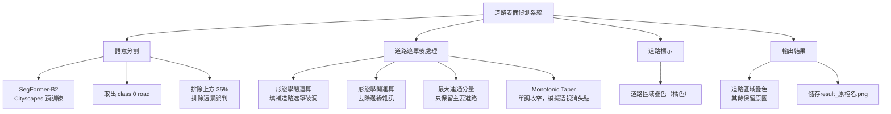
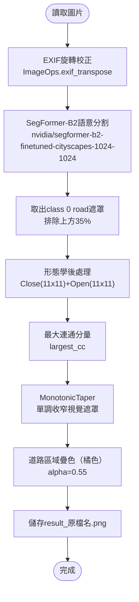

# 道路表面偵測專題

## 目錄

1. [需求](#需求)
2. [分析](#分析)
3. [設計](#設計)
4. [使用方式](#使用方式)
5. [參數調整](#參數調整)

---

## 需求

### 功能需求

| 項目 | 說明 |
|---|---|
| 輸入 | 單張或多張道路圖片（`.jpg` / `.png` / `.bmp`） |
| 輸出 | 道路區域以顏色標示的結果圖片（`result_原檔名.png`） |
| 命令列支援 | 可直接指定圖片，或自動掃描當前目錄 |

### 規格需求

| 項目 | 規格 |
|---|---|
| 語言 | Python 3 |
| 依賴套件 | `transformers`、`torch`、`torchvision`、`opencv-python`、`pillow`、`matplotlib`、`numpy` |
| 使用模型 | SegFormer-B2（Cityscapes 預訓練，`nvidia/segformer-b2-finetuned-cityscapes-1024-1024`） |
| 輸出格式 | PNG，與輸入圖片同目錄，檔名前綴 `result_` |

---

## 分析

### 系統架構



---

### 說明

#### `SegFormerForSemanticSegmentation` — 語意分割

| | |
|---|---|
| **WHAT** | 基於 Transformer 架構的語意分割模型，以 Cityscapes 資料集預訓練，可辨識 19 種城市場景類別。 |
| **WHY** | 傳統 HSV 顏色方法無法可靠分割灰色柏油路（與天空、建築顏色相近）；SegFormer 有語意理解能力，能直接識別「道路」類別像素。 |
| **HOW** | 將圖片輸入模型，取得各像素的類別 logits，透過 bilinear 插值還原至原始解析度，取 argmax 得到每個像素的預測類別；class 0 對應 road。 |

---

#### `monotonic_taper` — 單調收窄視覺遮罩

| | |
|---|---|
| **WHAT** | 由下往上逐行掃描道路遮罩，強制道路寬度只能縮窄、不能擴大，並以指數平滑跟隨道路中線。 |
| **WHY** | SegFormer 在反光路面或特殊場景下，有時會在中間某些 row 偵測到過寬的道路範圍，造成輸出遮罩中間突然橫向擴張的不自然現象；透視幾何決定道路向遠處只能縮窄。 |
| **HOW** | 從圖片底部向上掃，記錄前一 row 的半寬（prev_hw）與中心（prev_ctr）；每一 row 的半寬取 `min(當前寬, prev_hw)`，中心用指數平滑 `curr_ctr = (1-smooth)*prev_ctr + smooth*seg_ctr` 允許輕微彎道跟隨，最終結果與原始 SegFormer 遮罩取交集。 |

---

#### `morph_clean` — 形態學後處理

| | |
|---|---|
| **WHAT** | 對道路二值遮罩先做閉運算（Close）再做開運算（Open），使用橢圓形結構元素（11×11）。 |
| **WHY** | SegFormer 輸出的道路遮罩因車道線、斑馬線、積水反光等，常有小破洞或邊緣散落雜訊像素；需後處理使遮罩完整連續。 |
| **HOW** | 閉運算（先膨脹再侵蝕）填補道路內部小破洞；開運算（先侵蝕再膨脹）去除道路外側殘留的散點雜訊，橢圓形 kernel 避免方形截角造成的不自然輪廓。 |

---

#### `largest_cc` — 最大連通分量

| | |
|---|---|
| **WHAT** | 計算二值遮罩中所有連通區域，只保留面積最大的一塊。 |
| **WHY** | 形態學後仍可能存在多個分散的道路候選區域（如遠處路口、對向車道）；只保留主要道路區域可避免誤標邊緣碎片。 |
| **HOW** | 呼叫 `cv2.connectedComponentsWithStats` 取得各連通分量面積，找到最大分量的 label，輸出只包含該 label 的遮罩。 |

---

#### 顏色

| 類型 | 顏色 | RGB |
|---|---|---|
| 柏油路（Asphalt） | 橘色 | (255, 120, 30) |

---

## 設計

### 偵測流程



### 核心 API

| 函式 | 輸入 | 輸出 |
|---|---|---|
| `load_segformer()` | 無 | `(processor, model, device)` |
| `run_segformer(pil, proc, model, dev)` | PIL 圖片 | 像素級類別圖（H×W int32） |
| `monotonic_taper(road_mask, upper_cut)` | 道路 bool mask | 收窄後的視覺 bool mask |
| `morph_clean(mask, k)` | uint8 mask | 形態學清理後的 uint8 mask |
| `largest_cc(mask_u8)` | uint8 mask | 只保留最大連通分量的 uint8 mask |
| `process(path, proc, model, dev)` | 圖片路徑 | 儲存結果圖片、顯示並排圖 |

---

## 使用方式

### 安裝套件

```bash
pip install transformers torch torchvision pillow opencv-python matplotlib numpy
```

> 首次執行會自動下載 SegFormer 模型（約 330 MB），需要網路連線。

### 執行

**指定單張圖片：**
```bash
python 影像辨識_抓馬路.py road1.png
```

**指定多張圖片：**
```bash
python 影像辨識_抓馬路.py road1.png road2.png road3.png
```

**自動掃描當前目錄所有圖片：**
```bash
python 影像辨識_抓馬路.py
```

### 輸出

每張圖片產生一個 `result_原檔名.png`，存在與程式相同的目錄下。

| 輸入 | 輸出 |
|---|---|
| `road1.png` | `result_road1.png` |
| `road2.png` | `result_road2.png` |

---

## 參數調整

程式內可直接修改以下常數：

| 參數 | 位置 | 預設值 | 說明 |
|---|---|---|---|
| `upper` | `process()` | `H * 0.35` | 排除上方比例，調高→忽略更多遠景 |
| `k`（morph） | `process()` | `11` | 形態學 kernel 大小，調大→遮罩更平滑但可能過度填充 |
| `alpha`（疊色） | `process()` | `0.55` | 道路顏色透明度，調高→顏色越深 |
| `smooth`（taper）| `monotonic_taper()` | `0.25` | 中線平滑度，調高→更能跟隨彎道，調低→中線更穩定 |

| 問題 | 調整方式 |
|---|---|
| 道路沒被抓到 | 降低 `upper`（改為 `H * 0.25`），擴大道路搜尋範圍 |
| 遠景被誤判為道路 | 提高 `upper`（改為 `H * 0.45`） |
| 遮罩破碎不完整 | 提高 morph `k`（改為 13 或 15） |
| 道路邊緣不自然截斷 | 調整 `smooth`（`monotonic_taper` 的 smooth 參數調高至 0.4） |
